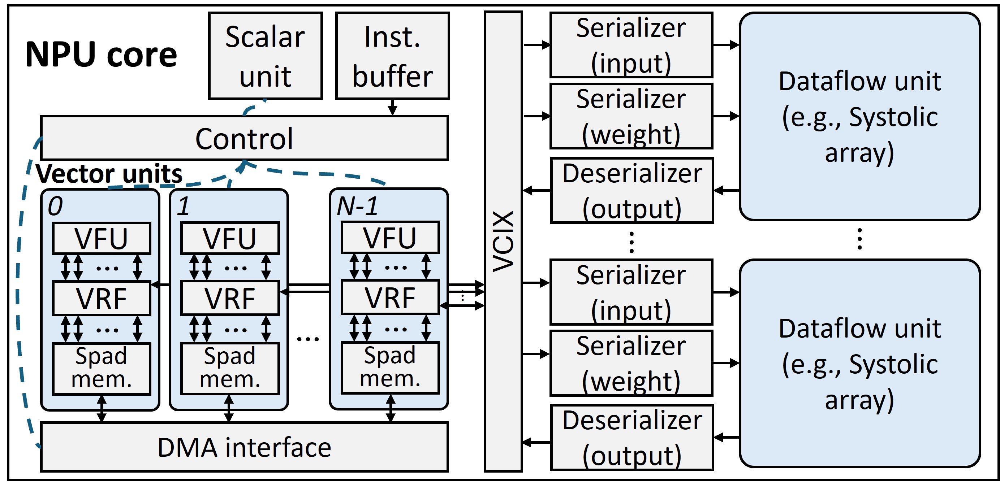

# PyTorchSim: A Comprehensive, Fast, and Accurate NPU Simulation Framework
[](https://github.com/PSAL-POSTECH/PyTorchSim/actions/workflows/docker-image.yml)

PyTorchSim is a comprehensive, high-speed, cycle-accurate NPU simulation framework.
- We define a RISC-V-based NPU architecture and implement PyTorch compiler backend to run inference & training for PyTorch models.
- Achieved high speed and accuracy with our novel Tile-Level Simulation (TLS) with compiler-generated Tile-Operation Graph (TOG), exploiting deterministic tile compute latency.
- A generic and extensible NPU architecture based on RISC-V vector extension.
- The functional simulator supports code correctness validation and data-dependent timing simulation.


For more details, please refer to our [paper](https://doi.org/10.1145/3725843.3756045)!
> **Disclaimer.** PyTorchSim is an independent project. It is neither part of the official [PyTorch](https://pytorch.org/) distribution nor affiliated with or endorsed by the PyTorch Foundation. The name reflects that this work builds on the open-source PyTorch compiler stack as its front-end for research purposes.

## Navigation
[Overview](#pytorchsim-framework-overview) | [Model Zoo](#model-zoo) | [Getting Started](#getting-started)

<!-- 
**Figure description**: we compare the simulation speed of PyTorchSim over [Accel-sim](https://accel-sim.github.io/) (a GPU simulator with Tensor Core model) as GPUs are widely used for deep learning and such a GPU simulator can be used to study systems for deep learning. We also include [mNPUsim](https://github.com/casys-kaist/mNPUsim) in the comparison. On the x-axis, we vary the size and workloads.


**Figure description**: PyTorchSim achieves significantly better accuracy than others ([SCALE-Simv3](https://github.com/scalesim-project/scale-sim-v3), [mNPUsim](https://github.com/casys-kaist/mNPUsim), [Timeloop](https://github.com/NVlabs/timeloop), [MAESTRO](https://github.com/maestro-project/maestro)) by supporting various optimizations, data transformations, and general vector operations. It achieved an 11.5% MAE (Mean Absolute Error) of runtime relative to the real TPUv3. -->

## PyTorchSim Framework Overview

PyTorchSim consists of **two main** components:
- **Compiler**: Integrated with the [PyTorch2](https://github.com/pytorch/pytorch) compiler stack; it generates NPU machine code and TOG for existing PyTorch models.
- **TOGSim**: Executes TOG for high-speed simulation and accurately models shared resources (DRAM, NoC) through integrated cycle-accurate simulators ([BookSim](https://github.com/booksim/booksim2) and [Ramulator2](https://github.com/CMU-SAFARI/ramulator2)).

PyTorchSim **supports**:
- DNN inference and [training](#training)
- Data-dependent timing modeling (e.g. sparsity)
- [One continuous TOGSim session](#one-togsim-session-one-continuous-log) (single log across multiple forwards)
- [Multi-tenancy](#multi-tenancy)
- [Compiler optimizations](#compiler-optimizations)
- [Mapping](#mapping)
- [L2 Cache](#l2-cache) (persistent cache)

## Model Zoo
| Model | Source | Status | Note |
|---|:-:|:-:|---|
| ResNet-18 |  | ✅ | channel last format |
| ResNet-50 |  | ✅ | channel last format |
| MobileNet-v2 |  | ✅ | `tests/MobileNet/` (torchvision) |
| YOLOv5 |  | ✅ | `tests/Yolov5/` |
| BERT |  | ✅ |  |
| GPT-2 |  | ✅ |  |
| ViT |  | ✅ | `tests/test_vit.py` |
| Mistral |  | ✅ | |
| Stable-diffusion v1 | 🤗 | ✅ |  |
| Llama 2/3 | 🤗 | ✅ | `tests/Llama/` (blocks & decode-style paths) |
| DeepSeek-V3 (base) | 🤗 | ✅ | `tests/DeepSeek/` — several ops(e.g., gate ops) are not cycle-modeled |
| Llama-4 | 🤗 | ⏳ | In development |
| Broader model support | — | ⏳ | In development |
<!-- ## Requirements

### OS Distribution
Recommended: Ubuntu 22.04

### Tested Environment
```bash
gcc == 11.4.0
g++ == 11.4.0
cmake == 3.26.4
conan == 1.56.0
python >= 3.10
pytorch == 2.2.0
riscv64-unknown-elf-gcc == 13.2.0
```
Our provided Docker environment resolves software dependencies.

### Hardware Dependencies
Any x86 hardware capable of running Docker with more than 20 GB of memory -->

## Supported Operations
- GEMM
- Batched GEMM
- Convolution
- Elementwise
- Reduction
- Batchnorm
- Layernorm
- Softmax
- Transpose
- View
- Activation
- Pooling
- Etc (WIP)

## Getting Started
### Quick start with pre-built Docker image

To download the latest Docker image and set up the environment, use the following commands:

```bash
# Run the Docker container
docker run -it --ipc=host --name torchsim -w /workspace/PyTorchSim ghcr.io/psal-postech/torchsim-ci:v1.1.0 bash
```
### Manual Setting (Optional)
This script builds [Gem5](https://github.com/PSAL-POSTECH/gem5.git), [LLVM](https://github.com/PSAL-POSTECH/llvm-project.git), and [Spike](https://github.com/PSAL-POSTECH/riscv-isa-sim.git) from source for advanced users.
```bash
bash scripts/build_from_source.sh
```
### Run Examples
The `tests` directory contains several AI workload examples.
```bash
python tests/test_matmul.py 
```
The result is written to `${TORCHSIM_LOG_PATH}/togsim_result/XXX.log`. The log file contains detailed core, memory, and interconnect stats.

### Run Your Own Model on PyTorchSim
You can run your own PyTorch model on PyTorchSim by setting up a custom NPU device.  
This method also applies when you want to simulate models beyond the provided examples.
```python
import torch

device = torch.device("npu:0")

# Declare your own model (e.g. resnet18 from torchvision)
from torchvision.models import resnet18
model = resnet18().eval()
x = torch.randn(1, 3, 224, 224, dtype=torch.float32)

# Move model and input tensors to the custom device
model.to(device)
x = x.to(device)

# Compile and run the model with PyTorchSim
compiled_model = torch.compile(dynamic=False)(model)
y = compiled_model(x)
```
`model` is your PyTorch model to be simulated, and `x` is the input tensor.
PyTorchSim automatically generates a Tile-Operation Graph (TOG), and runs it through the TOGSim backend.

### Result
Running log in CLI
```bash
[2026-04-22 11:29:20.139] [INFO] [pytorchsimfrontend.mlir.generated_wrapper] Wrapper Codegen Path = /workspace/PyTorchSim/outputs/.torchinductor/ru/cruz5mvhqeci3avet3ebv6outo6rbo7uiv477tj7u2zjlvfp6k5k.py
[2026-04-22 11:29:20.638] [INFO] [simulator.simulator] [Gem5] Gem5 simulation started
[2026-04-22 11:29:26.138] [INFO] [simulator.simulator] [Spike] Running Spike simulator
[2026-04-22 11:29:27.609] [INFO] [simulator.simulator] [TOGSim] TOGSim simulation started
[2026-04-22 11:29:28.217] [INFO] [simulator.simulator] [TOGSim] Simulation log is stored to "/workspace/PyTorchSim/togsim_results/20260422_112927_6fb9d704.log"
----------------------------
|Matmul Forward Test Passed|
----------------------------
```

Simulation consists of three steps

1. `Gem5` obtains compute latency for TOG.
2. `Spike` verifies the output code. It can also be used to model data-dependent timings.
3. `TOGSim` simulates an NPU architecture.

The log contains memory & core stats.
```bash
[2026-04-22 11:29:28.215] [info] [DRAM] Per-channel average bandwidth
[2026-04-22 11:29:28.215] [info] [DRAM] channel 0 | 15.51 GB/s avg., 51.56% of utilization | 4096 reads, 2048 writes
[2026-04-22 11:29:28.215] [info] [DRAM] channel 1 | 15.51 GB/s avg., 51.56% of utilization | 4096 reads, 2048 writes
[2026-04-22 11:29:28.215] [info] [DRAM] channel 2 | 15.51 GB/s avg., 51.56% of utilization | 4096 reads, 2048 writes
[2026-04-22 11:29:28.215] [info] [DRAM] channel 3 | 15.51 GB/s avg., 51.56% of utilization | 4096 reads, 2048 writes
[2026-04-22 11:29:28.215] [info] [DRAM] channel 4 | 15.51 GB/s avg., 51.56% of utilization | 4096 reads, 2048 writes
[2026-04-22 11:29:28.215] [info] [DRAM] channel 5 | 15.51 GB/s avg., 51.56% of utilization | 4096 reads, 2048 writes
[2026-04-22 11:29:28.215] [info] [DRAM] channel 6 | 15.51 GB/s avg., 51.56% of utilization | 4096 reads, 2048 writes
[2026-04-22 11:29:28.215] [info] [DRAM] channel 7 | 15.51 GB/s avg., 51.56% of utilization | 4096 reads, 2048 writes
[2026-04-22 11:29:28.215] [info] [DRAM] channel 8 | 15.51 GB/s avg., 51.56% of utilization | 4096 reads, 2048 writes
[2026-04-22 11:29:28.215] [info] [DRAM] channel 9 | 15.51 GB/s avg., 51.56% of utilization | 4096 reads, 2048 writes
[2026-04-22 11:29:28.215] [info] [DRAM] channel 10 | 15.51 GB/s avg., 51.56% of utilization | 4096 reads, 2048 writes
[2026-04-22 11:29:28.215] [info] [DRAM] channel 11 | 15.51 GB/s avg., 51.56% of utilization | 4096 reads, 2048 writes
[2026-04-22 11:29:28.215] [info] [DRAM] channel 12 | 15.51 GB/s avg., 51.56% of utilization | 4096 reads, 2048 writes
[2026-04-22 11:29:28.215] [info] [DRAM] channel 13 | 15.51 GB/s avg., 51.56% of utilization | 4096 reads, 2048 writes
[2026-04-22 11:29:28.215] [info] [DRAM] channel 14 | 15.51 GB/s avg., 51.56% of utilization | 4096 reads, 2048 writes
[2026-04-22 11:29:28.215] [info] [DRAM] channel 15 | 15.51 GB/s avg., 51.56% of utilization | 4096 reads, 2048 writes
[2026-04-22 11:29:28.215] [info] [DRAM] channels 0..15 combined | 248.13 GB/s aggregate, 51.56% of utilization (avg. per channel) | 65536 reads, 32768 writes
[2026-04-22 11:29:28.215] [info] ===== Instructions count =====
[2026-04-22 11:29:28.215] [info] Core [0] : MOVIN    inst_count: 2
[2026-04-22 11:29:28.215] [info] Core [0] : MOVOUT   inst_count: 1
[2026-04-22 11:29:28.215] [info] Core [0] : COMP     inst_count: 81 (GEMM: 80, Vector: 1)
[2026-04-22 11:29:28.215] [info] Core [0] : BAR      inst_count: 80
[2026-04-22 11:29:28.215] [info] ========= Core stat =========
[2026-04-22 11:29:28.215] [info] Core [0] : Systolic array [0] utilization(%): 34.37, active_cycles: 4096, idle_cycles: 7821
[2026-04-22 11:29:28.215] [info] Core [0] : Systolic array [1] utilization(%): 34.37, active_cycles: 4096, idle_cycles: 7821
[2026-04-22 11:29:28.215] [info] Core [0] : DMA active_cycles: 6144, DMA idle_cycles: 5773, DRAM BW: 248.000 GB/s (98304 responses)
[2026-04-22 11:29:28.215] [info] Core [0] : Vector unit utilization(%): 2.55, active cycle: 304, idle_cycle: 0
[2026-04-22 11:29:28.215] [info] Core [0] : NUMA local memory: 98304 requests, remote memory: 0 requests
[2026-04-22 11:29:28.215] [info] Core [0] : Total_cycles: 11917
[2026-04-22 11:29:28.215] [info] Total execution cycles: 11917
[2026-04-22 11:29:28.215] [info] Wall-clock time for simulation: 0.602899 seconds
```
The log is dumped in `TORCHSIM_LOG_PATH` and you can set the path as below.
```bash
export TORCHSIM_LOG_PATH=/tmp/torchinductor # output file dump path
```

## Training
`backward()` automatically generates TOG and executes simulation for backward propagation. If you want to simulate optimizers on NPU units, you can compile the optimizer’s step function.
```python
optimizer = torch.optim.Adam(model.parameters(), lr=0.001)
compiled_step = torch.compile(dynamic=False)(optimizer.step)

optimizer.zero_grad()
loss.backward()
compiled_step()
```
`tests/test_mlp.py` provides an example of MLP training.

## One TOGSim session, one continuous log

By default, each compiled operation can run TOGSim in a standalone way—typically **one simulator process and one log file per kernel**. That matches single-kernel workflows but splits traces when you run many forwards in a row.

`with TOGSimulator(config_path=...)` keeps **one TOGSim session** open for the block: successive calls (e.g. multiple `compiled_model(...)` forwards) run in sequence in the same process, so the timeline and shared resources continue in a single log instead of restarting for every op. `TOGSIM_CONFIG` is set to the given YAML for the block so codegen and TOGSim still share one hardware file.

Use the same API you already use; only wrap the region you want co-simulated:

```python
import torch
from Simulator.simulator import TOGSimulator

# ... build model, torch.compile, tensors on npu:0 as usual ...

with TOGSimulator(config_path=config):
    y = compiled_model(x)
```

<a id="multi-tenancy"></a>

## Multi-tenancy and explicit scheduling (`launch_model`)

For **multi-tenant** or **interleaved** execution, you usually need to attach a **timestamp** and a `stream_index` to each launch so the simulator can order work correctly. Use `torch.npu.launch_model(compiled_model, *inputs, stream_index=..., timestamp=...)` for that; plain `compiled_model(x)` does not carry those parameters.

`stream_index` is the **request-queue / partition index** in the TOGSim config: it must match the **values** in the `partition` map (each queue index is mapped to a **core**). For example, `stream_index=0` goes to the queue bound to `core_0`, `stream_index=1` to the queue for `core_1`, and so on.

`timestamp`** is in **nanoseconds** (simulation time for ordering launches). Use `0` when you do not need explicit times beyond submission order.

```python
with TOGSimulator(config_path=config):
    torch.npu.launch_model(opt_model1, x1, stream_index=0, timestamp=0)
    torch.npu.launch_model(opt_model2, x2, stream_index=1, timestamp=0)
    torch.npu.synchronize()
    torch.npu.launch_model(opt_model1, x1, stream_index=0, timestamp=0)
    torch.npu.launch_model(opt_model2, x2, stream_index=1, timestamp=0)
```

Here `synchronize()` acts as a barrier: it does not return until every `launch_model` issued **above** it has finished in the simulator. The later pair of `launch_model` calls therefore runs only after those earlier models have fully completed—so the sync is the point in the timeline where **all preceding launches are done**.

```bash
python tests/test_scheduler.py
```

Use a TOGSim config(`.yml`) that defines **partitions** when mapping queues to cores, for example:

- `num_partition`: Number of independent request queues (valid `stream_index` values are `0 … num_partition-1`).
- `partition`: Maps each **core** name to a **queue index**; that index is the same `stream_index` you pass to `launch_model`.

```
  "num_partition" : 2,
  "partition": {
    "core_0": 0,
    "core_1": 1
  }
```

Here `stream_index=0` selects queue `0` (core_0), `stream_index=1` selects queue `1` (core_1).

### 3. Load generation (Poisson arrivals)

The `poisson_request_generator` in `Scheduler.scheduler` yields synthetic **arrival times** (in **milliseconds**). Merge those with `launch_model`: convert each time to **nanoseconds** for `timestamp`, set `stream_index` to the target partition queue, and run all launches inside one `with TOGSimulator(...)` so a **single** log captures the full trace.

```python
from Scheduler.scheduler import poisson_request_generator

model0_lambda = 5.0
model1_lambda = 3.0
max_time_msec = 1000.0  # Poisson horizon [ms]

events = []
for t in poisson_request_generator(model0_lambda, max_msec_time=max_time_msec):
    x = torch.randn(1, 3, 224, 224, device=device)
    events.append((t, 0, opt_model0, (x,)))  # stream_index 0 → queue / partition 0

for t in poisson_request_generator(model1_lambda, max_msec_time=max_time_msec):
    x = torch.randn(128, 768, device=device)
    events.append((t, 1, opt_model1, (x,)))  # stream_index 1 → queue / partition 1

with TOGSimulator(config_path=config):
    for t_msec, stream_index, model, args in events:
        torch.npu.launch_model(
            model,
            *args,
            stream_index=stream_index,
            timestamp=int(t_msec * 1e6),
        )  # ms → ns
```

The two Poisson streams are **combined and sorted by time** so launches follow a single global arrival order.

## Compiler Optimizations
PyTorchSim compiler supports several fusion optimizations:
- GEMM prologue fusion
- GEMM epilogue fusion
- GEMM reduction fusion
- CONV epilogue fusion

Depending on tensor shape, use different convolution template:
- Single batch optimization
- Multi-channel optimization

## Mapping
PyTorchSim provides three mapping strategies.
### Heuristic-based mapping
We adopted and modified heuristic-based mapping from [GEMMINI](https://github.com/ucb-bar/gemmini) by default, which maximizes the utilization of scratchpad memory.
### Auto-tuning
The heuristic method may not be optimal for all cases. PyTorchSim provides auto-tuning to find the best mapping for GEMM, CONV, and vector operations. It reduces the search space by sorting candidates based on scratchpad memory utilization and picking the top-k candidates. Search parameters include tile shape and vector lane stride.

To enable this, update your configuration file as follows:
```bash
"codegen_mapping_strategy" : "autotune"
```
### Manual setting
Users can use third-party mapping tools (e.g., Timeloop). You can explicitly set the mapping file path in the configuration file to apply your own mapping strategies.
```bash
"codegen_mapping_strategy" : "external",
"codegen_external_mapping_file" : "path/to/mapping_file.json",
```
Key: "M_N_K" for GEMM
```
{
    "512_2048_8192" : {
        "TILE_M" : 512,
        "TILE_K" : 512,
        "TILE_N" : 1024
    },
    "512_2048_2048" : {
        "TILE_M" : 512,
        "TILE_K" : 512,
        "TILE_N" : 1024
    },
    "2048_2048_512" : {
        "TILE_M" : 1024,
        "TILE_K" : 512,
        "TILE_N" : 512
    }
}
```

## L2 Cache
It supports L2 cache as persistent cache. User can provide software-managed allocation/eviction strategy for tensors with persistent cache.

Common Memory (CMEM) is a new feature introduced in the latest TPUs (newer than TPUv3). Multiple cores share this memory, which provides high bandwidth. Reusable tensors are stored and loaded from CMEM to avoid off-chip traffic. Our L2 cache can work like CMEM.

To allocate a tensor in L2 cache, set the environment variable as shown below. The `tpuv4` directory provides example plans for L2 cache obtained from TPUv4 profiling.
```bash
export SRAM_BUFFER_PLAN_PATH=tpuv4/gemm_plan.py
```
The L2 cache strategy file is composed as follows:
```
plan = {
    "arg0_1"
}
```
In this example, only one input tensor is registered in L2 cache. You can refer to the tensor name from the wrapper code. After running the code, you can find the wrapper codegen path in the [result](#result) section.

Last but not least, you must set `l2d_type` and `l2d_config` in the [TOGSim config](#togsim-configuration) to use L2 cache. The `l2d_config` follows the same configuration method as [AccelSim](https://github.com/accel-sim/accel-sim-framework).

## Compiler Configuration
`PyTorchSimFrontend/extension_config.py` contains target hardware configuration to compile.

You can configure these options using environment variables.
```bash
export TORCHSIM_DIR=/workspace/PyTorchSim # home directory

# Plan which tensors are allocated in TPUv4's CMEM
export SRAM_BUFFER_PLAN_PATH=/workspace/PyTorchSim/tpuv4/gemm_plan.py
export TORCHSIM_USE_TIMING_POOLING=0 # use lightweight pooling for timing
```
## TOGSim Configuration


The `configs/` directory holds **YAML** (`.yml`) hardware descriptions. Set `TOGSIM_CONFIG` to one of these files. The **same file** is read by the **compiler** (`PyTorchSimFrontend/extension_config.py`) for `vpu_*`, `pytorchsim_*`, and `codegen_*` fields, and by **TOGSim** (`TOGSim/src/Common.cc`) for the simulator-specific keys below.

### Reference layout

```yaml
# --- Core (TOGSim) ---
num_cores: 1
core_freq_mhz: 940
core_stats_print_period_cycles: 10000
num_systolic_array_per_core: 2
# Optional: one entry per core, default ws_mesh
# core_type: [ws_mesh, ws_mesh]
# Optional STONNE cores: stonne_config_path, num_stonne_per_core, num_stonne_port

# --- VPU / scratchpad (compiler codegen; same YAML) ---
vpu_num_lanes: 128
vpu_spad_size_kb_per_lane: 128
vpu_vector_length_bits: 256

# --- DRAM config ---
dram_type: ramulator2          # ramulator2 | simple
dram_freq_mhz: 940
dram_channels: 16
dram_stats_print_period_cycles: 10000
ramulator_config_path: ../configs/ramulator2_configs/HBM2_TPUv3.yaml  # resolved relative to this YAML’s directory
# For ramulator2: request size, DRAM MHz, and per-channel peak GB/s are derived from the Ramulator YAML.
# dram_freq_mhz must exactly match MHz derived from Ramulator tCK or startup fails.

# simple DRAM (alternative to ramulator2):
# dram_type: simple
# dram_latency: 100
# dram_req_size_byte: 32   # optional, default 32
# dram_freq_mhz: <MHz>     # defaults to core_freq_mhz if omitted
# Optional bandwidth cap (set only one of the two):
# dram_bandwidth_gbps_per_channel: ...
# dram_bandwidth_gbps_total: ...
# If either bandwidth key is set, dram_freq_mhz is required.

# Optional: NUMA-style DRAM partitions (channels must divide evenly)
# dram_num_partitions: 2

# --- Interconnect (TOGSim) ---
icnt_type: simple              # simple | booksim2
icnt_latency_cycles: 10        # used when icnt_type is simple
icnt_freq_mhz: 940
icnt_injection_ports_per_core: 16
# icnt_stats_print_period_cycles: 0   # optional
# For icnt_type: booksim2, use booksim_config_path (not icnt_config_path):
# booksim_config_path: ../configs/booksim2_configs/fly_c16_m16.icnt

# --- Functional / timing flags (compiler; same YAML) ---
pytorchsim_functional_mode: 1  # 1 = run Spike validation, 0 = skip for faster runs
pytorchsim_timing_mode: 1

# --- Compiler mapping / optimizations (same YAML) ---
codegen_mapping_strategy: heuristic   # heuristic | autotune | external-then-heuristic | external-then-autotune
codegen_external_mapping_file: ''
codegen_autotune_max_retry: 10
codegen_autotune_template_topk: 4
codegen_compiler_optimization: all    # all | none | list of option names

# --- Optional L2 (TOGSim) ---
# l2d_type: nocache            # default if omitted
# l2d_type: datacache
# l2d_config: "S:64:128:512,32,..."   # required when l2d_type is datacache (AccelSim-style string)

# --- Optional scheduler / partitions (TOGSim; multi-queue) ---
# scheduler: simple
# num_partition: 2
# partition:
#   core_0: 0
#   core_1: 1
```

### Key fields (quick reference)

One-line meaning for each group (details in the YAML block above).

- **Core (`num_cores`, `core_freq_mhz`, `core_stats_print_period_cycles`, `num_systolic_array_per_core`, optional `core_type`, STONNE keys)**: how many cores, their clock, stats cadence, systolic count per core, and optional non-default mesh vs STONNE mix.
- **VPU (`vpu_*`)**: vector lane count, per-lane scratchpad (KB), and vector register width—**compiler** uses these for tiling/codegen.
- **DRAM (`dram_type`, `dram_channels`, …)**: `ramulator2` uses `ramulator_config_path`; `simple` uses fixed latency and optional bandwidth caps (`dram_bandwidth_gbps_*`, `dram_freq_mhz` when capped). `dram_num_partitions` splits channels for NUMA-style addressing.
- **Interconnect (`icnt_*`, `booksim_config_path`)**: `simple` adds fixed hop latency (`icnt_latency_cycles`); `booksim2` points at a BookSim2 topology file.
- **Codegen (`codegen_*`)**: mapping strategy (heuristic / autotune / external-hybrid), external JSON path, autotune search limits, and fusion/optimization set for the PyTorch compiler path.
- **L2 (`l2d_type`, `l2d_config`, optional `l2d_hit_latency`)**: optional data cache between cores and DRAM; `l2d_config` uses AccelSim-style cache geometry strings.
- **Scheduler (`scheduler`, `num_partition`, `partition`)**: request queues per partition and `core_i` → queue index mapping for multi-tenant / `launch_model` routing.
- **`pytorchsim_functional_mode`**: **`1`** runs **Spike** on generated code; **`0`** skips it for faster iteration.
- **`pytorchsim_timing_mode`**: **`1`** keeps the cycle-aware tile-graph path that feeds **TOGSim**; **`0`** turns that timing path off (functional-style runs; often paired with `pytorchsim_functional_mode` in tutorial configs).

## Tutorial
Check out our [ISPASS 2026 tutorial](https://www.youtube.com/playlist?list=PLYIb5dkr4isJ1ERKTKFoWdCKMUOaay2Nn) to learn:
- PyTorchSim architecture, motivation, and design goals
- The end-to-end PyTorch compilation pipeline (PyTorch code → FX → MLIR → LLVM → ISA)
- TPU-style NPU architecture and memory hierarchy
- Running and analyzing operators and DNN models in PyTorchSim
- Scheduling, mapping, optimization, and performance analysis tools
- Extending PyTorchSim with custom NPU ISA instructions

For tutorial setup, please refer to the [JupyterHub setup guide](https://github.com/PSAL-POSTECH/PyTorchSim/blob/ispass2026/tutorial/jupyterhub/README.md).

## Future Works
We plan to broaden **model coverage** (more workloads), support **dynamic-shape**, and extend **eager-mode** integration so a wider range of PyTorch programs can be simulated.

## Artifact Evaluation
Artifact evaluation is available for v1.0.0.
The following scripts reproduce the validation and speedup results from the paper.
### Build
```bash
docker run -it --ipc=host --name torchsim -w /workspace/PyTorchSim ghcr.io/psal-postech/torchsim-ci:v1.0.0 bash
```

To generate validation results
```bash
# Run a cycle accuracy script
./experiments/artifact/cycle_validation/run_cycle.sh
```
To generate speedup results
```bash
# Run a speedup accuracy script
./experiments/artifact/speedup/run_speedup.sh
```

## Contributing
We welcome any contributions and issue reports.
Please refer to the [Contributing Guide](https://github.com/PSAL-POSTECH/PyTorchSim?tab=contributing-ov-file) for details.

## Citation
If you use PyTorchSim for your research, please cite the following paper.
```
@INPROCEEDINGS{yang2025pytorchsim,
  author={Yang, Wonhyuk and Shin, Yunseon and Woo, Okkyun and Park, Geonwoo and Ham, Hyungkyu and Kang, Jeehoon and Park, Jongse and Kim, Gwangsun},
  title={PyTorchSim: A Comprehensive, Fast, and Accurate NPU Simulation Framework},
  booktitle={Proceedings of the 58th IEEE/ACM International Symposium on Microarchitecture},
  pages={1363–1380},
  year={2025},
  doi={10.1145/3725843.3756045},
  series={MICRO '25}
}
```
